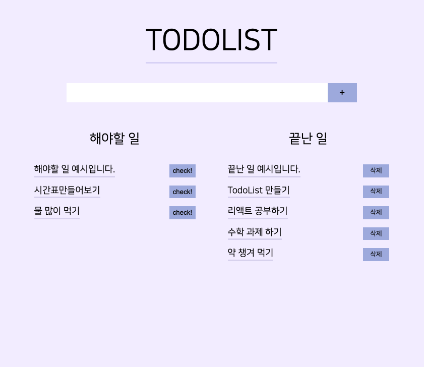

# TodoList!

### React를 곁들인..

---

### TMI

처음 react 미니 프로젝트를 뭘해볼까 하다가 선택된 그 흔한 todolist..
하지만 체크박스와 detele로 되어있는 todolist는 너무 많이 접해봐서 내가 만들고 싶은대로 만들어보았습니다.

---

### 기능

###### 할일 추가

input 칸에 할일을 입력하고 'Enter'를 치거나 옆의 '+' 버튼을 누르면 해야할 일에 추가됩니다.

###### 해야할 일 'check!' 하기

해야할 일로 추가된 항목 옆의 'check!'를 클릭하면 끝난 일 항목으로 옮겨집니다.

###### 끝난 일 '삭제' 하기

## 끝난 일을 더 이상 그만 보고싶다! 하면 항목 옆의 '삭제'를 클릭하면 사라집니다.

---

### 예시

---

